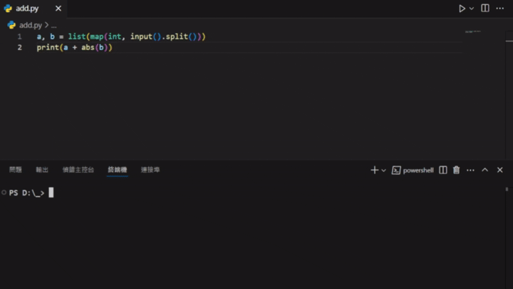

# offline-judge-cli
在本機環境跑測資，請注意，目前只支援Windows

## 展示

## 下載與安裝

請至 [Releases](https://github.com/yeizero/offline-judge-cli/releases) 下載最新的 `offline-judge-cli.zip` 檔案並解壓縮。

至少含有以下檔案：
- judge.exe - 用來執行測資
- judgeg.exe - 用來生成測資
- config.yaml

需要手動配置程式語言的環境，可選擇
- [下載 Python](https://www.python.org/downloads/)
- [下載 C++ (windows)](https://github.com/niXman/mingw-builds-binaries/releases)
- [下載 Java](https://www.oracle.com/tw/java/technologies/downloads/)