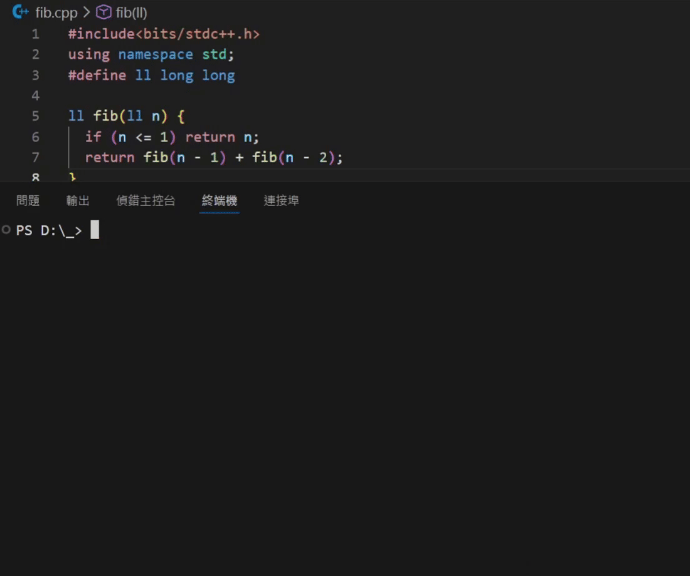

# offline-judge-cli

在本機環境跑測資，目前支援Windows和Linux，其他平台可能可編譯但無法監測記憶體

## 展示



# 下載與安裝

## Windows

請至 [Releases](https://github.com/yeizero/offline-judge-cli/releases) 下載最新的 `offline-judge-cli.zip` 檔案並解壓縮。

解壓縮後，建議將解壓縮後的 `/bin` 目錄加入系統 PATH，方便在任何地方使用 `judge` 和 `judgeg` 指令。

至少包含以下檔案：
- `judge.exe` - 用來執行測資
- `judgeg.exe` - 用來生成測資
- `config.yaml` - 公共設定

需要手動配置程式語言的環境，可選擇
- [下載 Python](https://www.python.org/downloads/)
- [下載 C++ (windows)](https://github.com/niXman/mingw-builds-binaries/releases)
- [下載 Java](https://www.oracle.com/tw/java/technologies/downloads/)

## Linux

1. 安裝 Rust：

   ```bash
   curl --proto '=https' --tlsv1.2 -sSf https://sh.rustup.rs | sh
   source $HOME/.cargo/env
   ```

2. 下載並編譯專案：

   ```bash
   git clone https://github.com/yeizero/offline-judge-cli.git
   cd offline-judge-cli
   ```

3. 執行打包腳本：

   ```bash
   ./scripts/build.bash
   ```

   * 打包後可在 `target/packed` 找到 `judge` 與 `judgeg`。

4. 執行測資：

   ```bash
   # 使用 judgeg 生成測資
   ./target/packed/judgeg
   # 使用 judge 評測
   sudo ./target/packed/judge solution.cpp
   ```

> **為什麼 judge 建議使用 `sudo`**：
> 為了監測程式記憶體使用量，`offline-judge-cli` 會使用 **cgroup (control group)** 功能。
> 由於 cgroup 目錄通常需要 root 權限才能讀寫（例如 `/sys/fs/cgroup`），因此若未以 `sudo` 執行，將無法正確讀取記憶體統計資訊。
> 
> 即使沒有 `sudo`，程式仍可正常比對輸出，只是無法顯示記憶體消耗。

# 核心概念

本工具主要圍繞兩種類型的 YAML 檔案運作：

1.  **測試集檔案 (`<題目名稱>.yaml`)**:
    *   這是與你的程式碼檔案同名的 YAML 檔，例如 `solution.cpp` 對應 `solution.yaml`。
    *   它包含了所有的測試案例（輸入和預期輸出）以及該題的時間/記憶體限制。
    *   你可以使用 `judgeg` 工具以互動方式輕鬆建立和管理這個檔案。

2.  **全域設定檔 (`config.yaml`)**:
    *   這個檔案定義了工具的通用行為，例如如何編譯和執行不同語言的程式碼、編輯器設定、外掛程式等。
    *   它應該與 `judge` 和 `judgeg` 執行檔放在同一目錄，或透過 `-c` 參數指定路徑。

# 快速入門

讓我們透過一個簡單的流程來了解如何使用。

### 1. 撰寫你的程式碼

首先，建立一個解答檔案，例如 `p1.cpp`。

```cpp
// p1.cpp
#include <iostream>

int main() {
    int a, b;
    std::cin >> a >> b;
    std::cout << a + b << std::endl;
    return 0;
}
```

### 2. 使用 `judgeg` 建立測資

在終端機執行 `judgeg`，它會以互動方式引導你建立測試集。

```bash
> judgeg
```

程式會依序詢問：
1.  **配置檔案名稱**: 輸入 `p1` (會自動生成 `p1.yaml`)。
2.  **動作**: 選擇 `新增測資`。
3.  **測資輸入**: 輸入 `1 2`。
4.  **測資答案**: 輸入 `3`。

重複以上步驟新增更多測資，完成後選擇 `完成`。接著，因為我們已經手動建立了 p1.cpp，當工具詢問是否要建立檔案時，選擇 `取消` 即可。
現在你的目錄下應該會有一個 `p1.yaml` 檔案。

### 3. 使用 `judge` 進行評測

現在，你可以執行 `judge` 來評測你的程式碼了。

```bash
> judge p1.cpp
```

它會自動找到 `p1.yaml` 作為測資來源，並輸出評測結果：

```
🔨 正在編譯檔案
____________ Test 1 ____________

✅ [AC] 答案正確！

📊 記憶體使用量: 2892 KiB / 1,048,576 KiB
⏱️ 程式執行耗時: 5 ms / 2,000 ms

📝 總結:                正確 1 錯誤 0 正確比 100%
.------------------------------------------------.
|     測資  用時 (ms)  記憶體 (KiB)  結果        |
|================================================|
| ✅  1     5          2,892         答案正確 AC |
'------------------------------------------------'
🎯 答案正確 AC (5 ms, 2892 KiB)
```

## `judge` 指令詳解

`judge` 是用來編譯、執行並評測程式碼的核心工具。

**用法**: `judge <FILE> [OPTIONS]`

*   `<FILE>`: 必要參數，指定要評測的原始碼檔案路徑 (例如 `solution.cpp`)。

**所有選項**:

| 短選項 | 長選項        | 說明                                                               |
| :----- | :------------ | :----------------------------------------------------------------- |
| `-c`   | `--config`    | 指定測試集檔案路徑。預設為與 `<FILE>` 同名的 `.yaml` 檔。          |
| `-T`   | `--time`      | 覆寫時間限制 (單位: 毫秒 ms)。                                      |
| `-M`   | `--memory`    | 覆寫記憶體限制 (單位: KiB)。                                       |
| `-n`   | `--no-judge`  | **無評判模式**：直接執行程式碼，不讀取測資檔、不比對答案。適合單純執行。 |
| `-l`   | `--lang`      | 手動指定程式語言 (例如 `cpp`, `py`)，覆寫自動偵測。                |
| `-w`   | `--warmup`    | 覆寫預熱執行次數。可能可得到更穩定的評測結果。               |
| `-f`   | `--force`     | 強制重新編譯原始碼，忽略緩存 |
| `-v`   | `--verbose`   | 顯示詳細的編譯和執行過程資訊。                                     |
| `-h`   | `--help`      | 顯示幫助訊息。                                                     |
| `-V`   | `--version`   | 顯示版本資訊。                                                     |

## `judgeg` 互動式測資管理器

`judgeg` 是一個互動式的 CLI 工具，讓你輕鬆管理測試集 (`.yaml` 檔案)。

**用法**: 直接執行 `judgeg` 即可進入互動介面。

**主要功能**:
*   **新增測資**: 逐一新增輸入與答案。支援直接在終端機輸入或呼叫外部/內建編輯器。
*   **刪除測資**: 刪除指定的測試案例。
*   **設定限制**: 設定該測試集專屬的時間與記憶體限制。
*   **進階操作**: 透過 `config.yaml` 中設定的外掛程式執行額外操作 (例如：從 Online Judge 網站抓取測資)。

## 測試集檔案 (`<problem_name>.yaml`)

這個檔案儲存了單一題目的所有測資和限制。

**範例 (`p1.yaml`)**:
```yaml
# 該題目的限制，若省略則使用全域預設值
limit:
  time: 1000      # 單位: ms
  memory: 262144  # 單位: KiB (256MB)
# 測試案例列表
cases:
- input: |-
    1 2
  answer: |-
    3
- input: |-
    100 -50
  answer: |-
    50
```

## 全域設定檔 (`config.yaml`)

這個檔案控制 `judge` 和 `judgeg` 的全域行為。

#### `evaluator` - 評測器設定

定義如何編譯與執行各種程式語言。

```yaml
evaluator:
  languages:
    - extension: cpp
      compile:
        command: "g++ -O2 -std=c++17 -static {source} -o {output}"
    - extension: py
      run:
        command: "python {source}"
    - extension: java
      compile:
        command: "javac -d {output_folder} {source}"
      run:
        command: "java -cp {output_folder} {source_stem}"
  # 全域預設的預熱次數
  warmup: 1
  # 單一測資允許的標準輸出上限，單位為 MiB (預設16MiB)；超過時終止程式並回報 OLE。
  stdout_limit: 16
  # 單一測資保留的標準錯誤上限，單位為 MiB (預設16MiB)；超過時繼續排空但截斷顯示。
  stderr_limit: 16
```

**可用變數**:
*   `{source}`: 原始碼檔案的完整路徑 (e.g., `C:\Users\...\p1.cpp`)。
*   `{output}`: 編譯後產生的執行檔路徑。
*   `{output_folder}`: `{output}` 所在的目錄路徑。
*   `{source_stem}`: 原始碼檔名，不含副檔名 (e.g., `p1`)。

#### `generator` - 測資產生器設定

設定 `judgeg` 的行為。

```yaml
generator:
  # 設定編輯測資時呼叫的編輯器，可以是外部程式
  # editor: vim
  
  # 或使用內建編輯器並自訂快捷鍵
  editor:
    keymap:
      ctrl+h: CursorLeft
      ctrl+j: CursorDown
      ctrl+k: CursorUp
      ctrl+l: CursorRight
      ctrl+q: Exit

  # 定義可以從 judgeg 選單中呼叫的外掛程式
  plugins:
    - name: "從 ZeroJudge 讀取測資"
      command: "python plugins/zerojudge.py"
    - name: "顯示目前路徑"
      command: "pwd"
```

# 貢獻

歡迎任何形式的貢獻！如果你有任何建議、發現 bug，或想要新增功能，請隨時提出 [Issue](https://github.com/yeizero/offline-judge-cli/issues) 或發送 Pull Request。

# 授權條款 (License)

Copyright 2025 Yeizero

本專案採用 **Apache License 2.0** 授權。

您可以根據授權條款的規定，自由地使用、修改和散布本軟體。完整的授權條款內容請參見 `LICENSE` 檔案。
